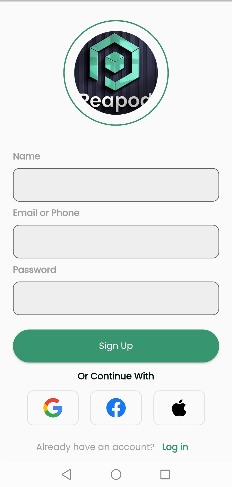

### Peapod

A polished Flutter grocery shopping UI with onboarding, authentication flow, home discovery, product details, cart, and profile screens. Built with Material 3 styling and custom components.

### Features
- **Onboarding**: 3-step intro with `smooth_page_indicator`
- **Auth flow**: Login, signup, verify mobile, set password
- **Home**: Categories, carousel banners, top picks, discover grid, search/filter
- **Product details**: Product info with images and add-to-cart CTA
- **Cart & favourites**: Basic cart and wishlist screens
- **Profile**: Profile overview and options
- **Bottom navigation**: Quick access across core sections
- **Theming**: Centralized colors and `Poppins` font

### Tech stack
- **Flutter**: SDK >= 3.1.0
- **Packages**:
  - `smooth_page_indicator`
  - `flutter_svg`
  - `fluttertoast`
  - `carousel_slider`
  - `device_preview`
  - `shimmer`
  - `cupertino_icons`

### App structure
```
lib/
  main.dart
  bottmNavigation.dart
  onboard_screen.dart
  constants/
    Appcolors.dart
  components/
    CartItem.dart
    productCard.dart
    profileOption.dart
    topPickCard.dart
  screens/
    cart.dart
    favourites.dart
    home.dart
    list.dart
    login.dart
    productDetails.dart
    profile.dart
    setpassword.dart
    signup.dart
    verifyMobile.dart
assets/
  [images, svgs, fonts incl. Poppins]
```

### Routing
Key named routes defined in `main.dart`:
- `/login`, `/signup`, `/onboaringscreen`, `/verifymobile`, `/setpassword`, `/home`, `/bottomnavigation`, `/productDetails`

### Getting started

#### Prerequisites
- Flutter SDK installed and on PATH
- Android Studio / Xcode for device/emulator
- Windows/macOS/Linux supported; iOS requires macOS

#### Install dependencies
```bash
flutter pub get
```

#### Run (debug)
```bash
flutter run
```

#### Build
- Android APK:
```bash
flutter build apk --release
```
- iOS (on macOS):
```bash
flutter build ios --release
```
- Web:
```bash
flutter build web --release
```
- Windows:
```bash
flutter build windows --release
```

### Configuration
- **Assets**: Declared via `flutter -> assets: - assets/` in `pubspec.yaml`
- **Fonts**: `Poppins` configured under `flutter -> fonts`
- **Theme**: Edit `AppColors` in `lib/constants/Appcolors.dart` and `ThemeData` in `main.dart`

### Screens and components
<p align="center">
  
  
  
  
  
  
</p>
